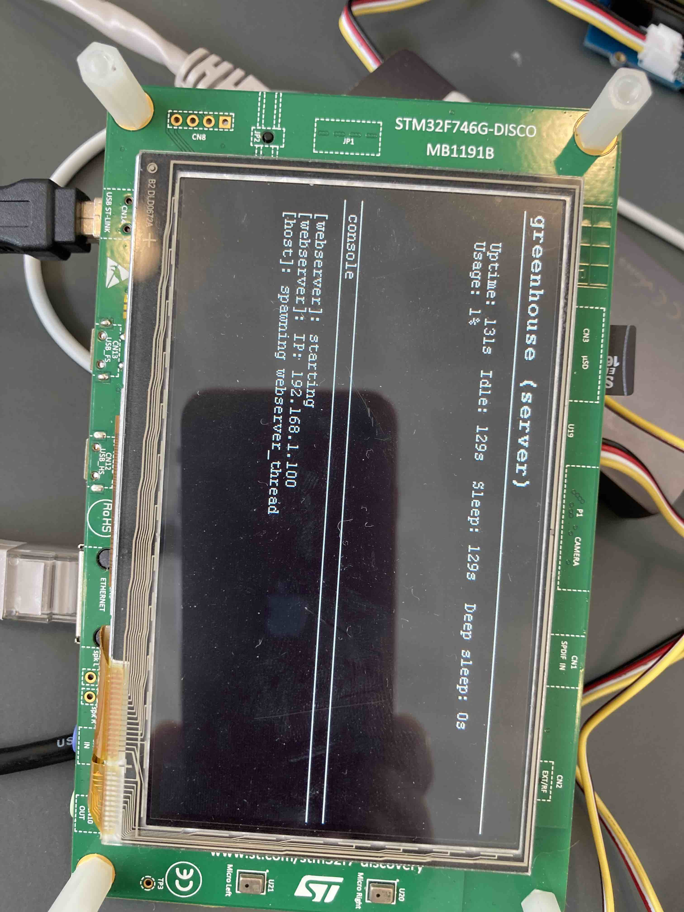

# Greenhouse

Server component of STM32 greenhouse project.



## Features

- HTTP Webserver

## WebServer

| IP | Port | Protocol |
|----|------|----------|
| 192.168.1.100 | 443 | HTTPS |

### Endpoints

| URL | Method | Status | Description |
|-----|--------|--------|-------------|
| `/` | `GET`  | `200`  | Homepage    |
| `/` | `POST` | `204`  | Destination for sensor data in CSV format |

#### Sample request

```text
* Preparing request to http://192.168.1.100/
* Current time is 2021-08-10T08:24:52.114Z
* Using libcurl/7.73.0 OpenSSL/1.1.1k zlib/1.2.11 brotli/1.0.9 zstd/1.4.9 libidn2/2.1.1 libssh2/1.9.0 nghttp2/1.42.0
*   Trying 192.168.1.100:80...
* Connected to 192.168.1.100 (192.168.1.100) port 80 (#0)

> POST / HTTP/1.1
> Host: 192.168.1.100
> Accept: */*
> Content-Length: 11

| 10.3,95,100

* upload completely sent off: 11 out of 11 bytes
* Mark bundle as not supporting multiuse

< HTTP/1.1 204 No Content
< Connection: Close

* Closing connection 0
```